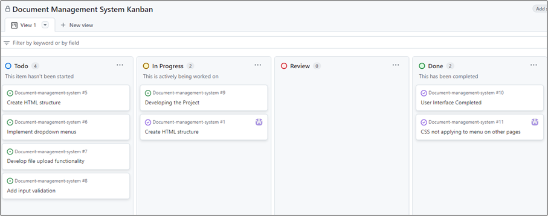
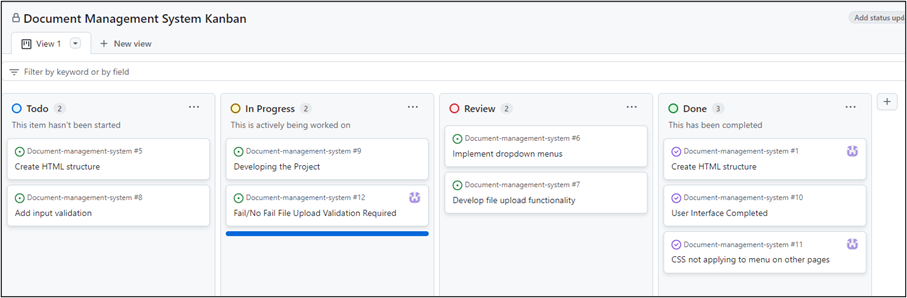
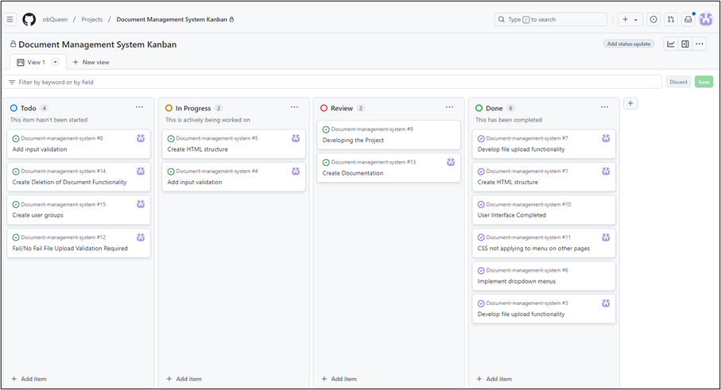
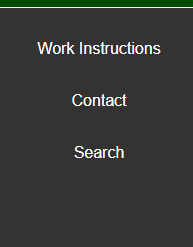
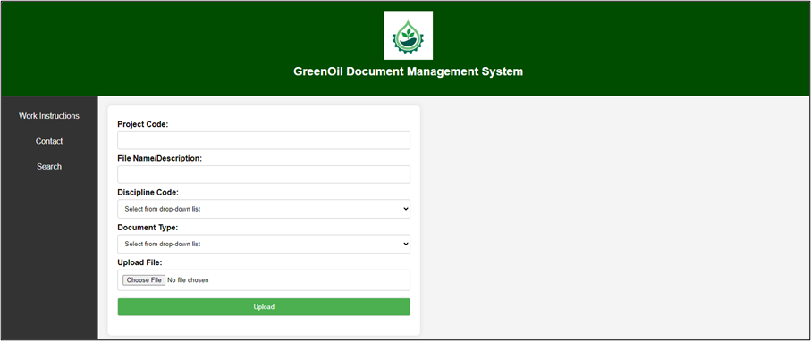
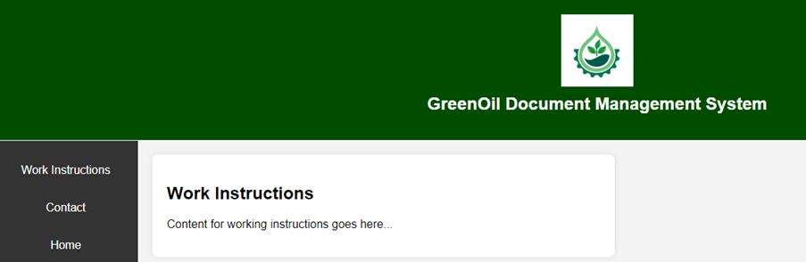
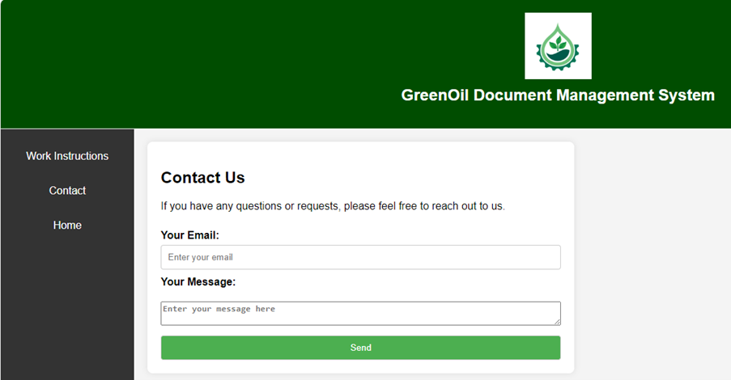
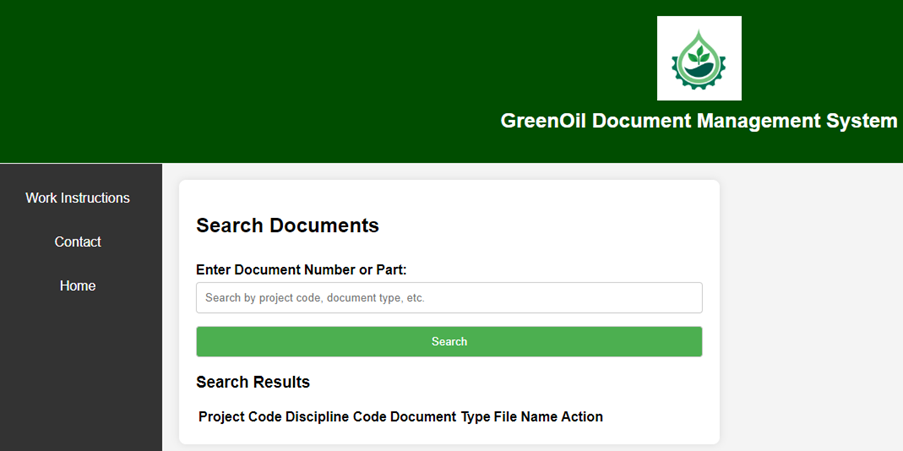

  

   
    <em>Logo Source: Ratsanai(2024) </em>
  

  <h1> GreenOil Document Management System </h1>

A simple document management system for uploading files with input validation

## **Project Overview**
This project is a Document Management System (DMS) designed to help users manage, upload, and organise documents efficiently. It features a ‘Home’ page, ‘Work Instructions’ page,  ‘Contact Us’ page, and a ‘Search Page’. The project aims to implement various functionalities such as document uploading, deletion, user group management, and input validation.
*	Home Page  : serves as the central hub for the Document Management System. It provides users with an overview of the system, quick access to other pages (such as Contact Us and Work Instructions), and a welcoming introduction to the platform.

*	Contact Us Page allows users to reach out with inquiries, feedback, or requests. It includes a text input field where users can enter their email and message, providing an easy way to get in touch with the team behind the document management system.

*	Work Instructions Page : The Work Instructions Page provides users with detailed instructions or step-by-step instructions on how to use the document management system. 

*	Search Page enables users to search for specific documents within the system. Users can input keywords, and the system will display relevant documents, helping users find and access information quickly and efficiently.
  
## **Project Management**

A Kanban Board was utilised to schedule tasks and manage project milestones throughout the development process. This agile approach allowed for better organisation and clearer task prioritisation. The Kanban board visually represented all project tasks and provided a dynamic view of the project's progress.

The board was divided into several key columns, such as To Do, In Progress, Review and Done. As tasks moved through these stages, it ensured a continuous flow of work while minimizing bottlenecks. It meant that I could easily track what needed attention and where delays might have occurred, facilitating timely intervention.

Below are sample screenshots taken during the mid-development phase of our project, showcasing how the Kanban board was structured and how tasks evolved as we progressed toward meeting key project milestones. These snapshots reflect the current state of task completion, as well as any adjustments made based on feedback and project requirements.

### **How To Access the Project**
To access and run the project on your local machine, follow these steps:
* Open a terminal (command prompt) and run the commands below:
git clone https://github.com/username/document-management-system.git
Note: Replace `username` with your actual GitHub username.
* navigate into the project folder: cd document-management-system
* Open the Project in Your Browser
Since this project is a simple HTML, CSS, and JavaScript application, no server is required. You can open any of the HTML files directly in your browser:
* Home Page: ‘F_Index5.html’
    * Contact Us Page: ‘FContact.HTML
    * Work Instructions Page: ‘FWork_Instructions.HTML’
    * Search Page: ‘FSearch.HTML’
* Double-click on the `F_Index5.html` file (or any HTML file) to open the page in your default web browser.
  

   
  

  
## Testing
#### Lighthouse Audit

 I conducted a performance, accessibility, best practices, and SEO audit. The results below indicated that the application performs excellently in terms of speed and general best practices. However, addressing accessibility and SEO issues will make it more user-friendly and search engine optimised.  

| Metric      | Score      | 
|----------------|----------------|
| Accessibility  | 83%  | 
|Best Practices   | 96%   | 
|Performance  | 100%  |
|SEO   | 83%   | 

### User Testing
I conducted user testing by attempting to upload a file. 
- **Positive**: The interface is simple and easy to use.
- **Suggestions**:
  *  Improve error handling for empty input fields.
  *  Provide fail/success message to users
 
  *  ### **Current Open Issues**
* Due to time constraints, the project is yet to be completed. Below is a list of the key open issues still being worked on for the Document Management System:
* Implement user roles (Admin, Editor, Viewer) to control access to documents.
* Enable users with Admin access to delete documents from the system.
* Implement validation to ensure that files uploaded meet specified criteria (e.g., file size, file type).

### **Future Enhancements**
* User Authentication: Implement a user authentication system to allow users to register, log in, and manage documents based on their roles.
* Search Functionality: Add a search feature to allow users to quickly find documents by keyword or metadata.
* Document Versioning: Implement a version control system for documents.

### **Technical Details**
* Languages
    *  HTML for page structure and layout.
    *  CSS for styling and visual presentation.
    * JavaScript for form validation, file upload, and interactivity.
*  Hosting:  GitHub(2024)

  

## User Manual
### **How To Run the Project**
The project is composed of static files (HTML, CSS, JavaScript) and does not require any additional setup or back-end server to function. Simply open any of the `.html` files in a browser to access the functionality.

#### *How to Upload a File*
* Launch GreenOil DMS
* Type in the Operation Code, also know as OP Code. This code should have been issued to the Project Manager by the Programme Controls department. 
Syntax for OP Code is:  OPXXXXXX where XXXXXX are six(6) numeric numbers.
* Type in file name/description.
* Select discipline code from the drop-down list. The discipline code refers to the functional  department the document applies to. For example, Engineering.
* Select document type from the drop-down list. A document type refers to the classification of documents. For example, Report.
* To upload a file, click on “choose file --> navigate to the location of the file on your drive --> select the file --> then click on the “Upload Button"
  

#### *Work Instruction Menu*

There are a number of work instructions for each function available in the DMS. Simply click on a file to view or download.

#### *Contact Us Menu*

This is used to request training and technical/non-technical support.

* Click on ‘Contact” and this will take you to the Contact Us page.
* Fill in your email , type in your message and simply click on the ‘Send’ button.

#### *Search Menu*
To search for, view and dowload a document
*  Click on the 'Search' link located on the Home page.
*  Type in part or all of the document number as your search criteria in the "Enter Document Number or Part:" input field
*  Click on the "Search Button"
*  The result will be displayed in a table format.

  

  
### *Contact/Feedback*

If you have any questions or feedback regarding the project, please email : xxxxxxx@nulondonstudents.org 

  
#### REFERENCES
Ratsanai(2024) Eco Friendly[Online]. Available at: https://www.istockphoto.com/vector/eco-friendly-gm2184694927-603506874. (Accessed: 11 December 2024)

GitHub(2024) GitHub [Online]. Available at: https://github.com/ (Accessed: 11 December 2024)

GitHub Docs(2024) Hello World[Online]. Available at: https://docs.github.com/en/get-started/start-your-journey/hello-world (Accessed: 13 December 2024)

